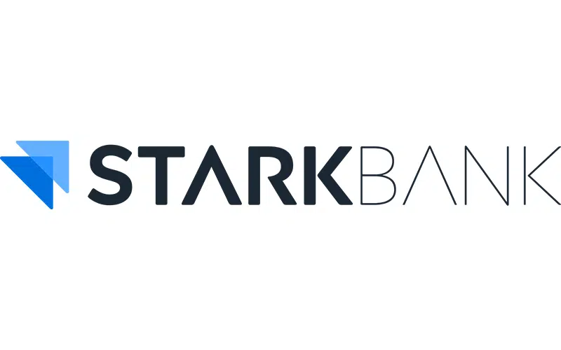

# StarkGeist - StarkBank Hackaton

<table>
<tr>
<td>

</td>
</tr>
</table>

# StarkGeist: Oráculo da sua empresa

# Integrantes:

* [Arthur Tsukamoto](https://www.linkedin.com/in/arthur-tsukamoto/)
* [Henrique Godoy](https://www.linkedin.com/in/henrique-godoy-879138252/)
* [José Vitor Alencar](https://www.linkedin.com/in/fabio-piemonte-823a65211/)

# Descrição do Projeto

Para empresas de médio a grande porte, nossa ferramenta ajuda CFOs, CEOs e Diretores de Estratégia a tomar decisões estratégicas com precisão. Analisando dados financeiros e macroeconômicos e simulando cenários de "what if", a ferramenta oferece previsões exatas e insights detalhados, garantindo uma gestão precisa e um planejamento estratégico eficaz para moldar o futuro da empresa.

# Documentação e Artigo

Os arquivos da documentação deste projeto estão na pasta [/docs](/docs), inclusive os arquivos do artigo.

# Código

Os arquivos de código estão na pasta [/src](/src).
